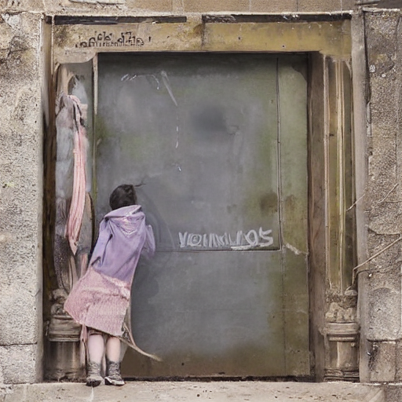

# Audio Memory → Image Generation

This project generates evocative images from songs by fusing audio features and lyrical semantics into a shared latent space. Rather than producing literal visualizations, the system aims to simulate how music is remembered as impressions, emotions, and associations.

## Overview

The system converts a song into a cross-modal embedding by:

- Extracting instrument stems from audio  
- Encoding sonic characteristics into latent vectors  
- Encoding lyrics into CLIP text embeddings  
- Fusing audio and language representations  
- Generating an image via Stable Diffusion  

The final output is an abstract visual of the song.

> Design goal is to simulate human memory of sound rather than exact waveform recall.

## Pipeline

- Song is loaded and converted to a numerical array (respecting sample rate and mono/stereo).
- Audio is converted to a Torch tensor.
- Source separation produces four stems:
  - vocals  
  - drums  
  - bass  
  - other  

Each stem is processed with **OpenL3** to produce a 512-dimensional embedding capturing:

- timbre  
- rhythm  
- harmonic structure  

Temporal information is collapsed by computing the **mean and standard deviation over time**.

All stem summaries are concatenated into a single fixed-length audio vector representing the song’s holistic sonic character.

- Lyrics are tokenized to **77 tokens**.
- Tokens are encoded into **77 × 768 CLIP embeddings**.
- Each vector captures semantic meaning and associative context.

This provides the **language lens** for image generation.

- The audio vector is projected into CLIP embedding space.
- It is broadcast across all lyric tokens.
- Each token embedding is subtly perturbed by the audio signal.

The audio acts as a semantic bias, shaping how the lyrics are interpreted, which is an analogy to how humans interpret lyrics through the emotional tone of the music.

- Fused embeddings are passed to Stable Diffusion.
- The model generates a visual output representing the song’s cross-modal memory.

## Conceptual Motivation

This project explores:

- collective vs. personal memory  
- psychogeography of sound  
- visual synesthesia  
- machine interpretation of music  

- Images are generated via computational analysis of audio and lyrics.
- No audio is reproduced or redistributed.
- All music remains the property of its respective rights holders.
